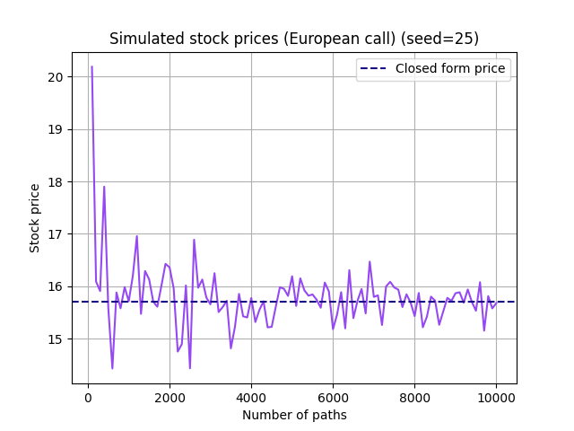
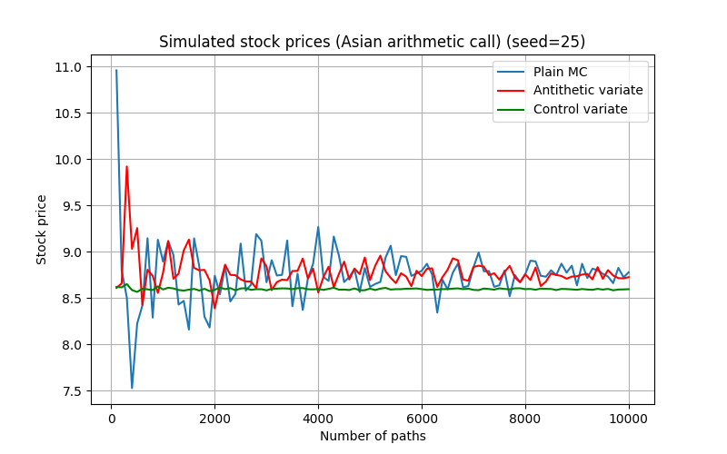
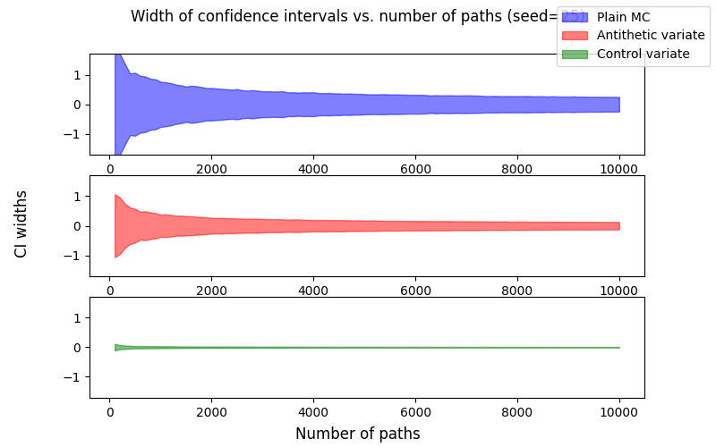
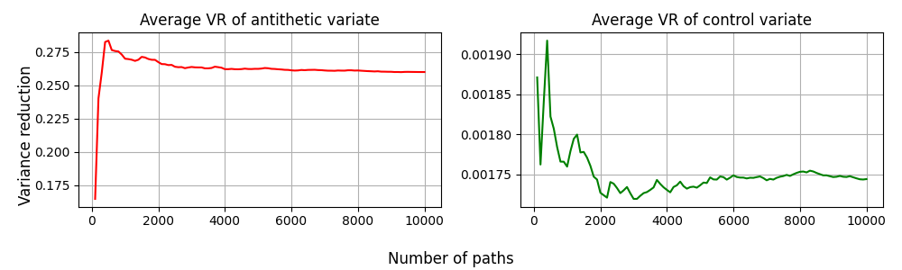

# Monte Carlo Exotic Option Pricing with Variance Reduction

This project implements a Monte Carlo simulation engine for pricing Asian arithmetic-average call options under the Black–Scholes model. The goal is to estimate these option prices using simulated Geometric Brownian Motion stock-price paths and demonstrate how Antithetic and Control Variate techniques can dramatically improve accuracy for the same computational cost.

---

## Features

- Geometric Brownian Motion (GBM) price path simulator under the discretized Black-Scholes model
- Functions for plain Monte Carlo (MC), Antithetic variate, and Control variate simulations supporting any payoff type
- Validation script for plain Monte Carlo (MC) pricing of European calls, comparing simulated prices to Black-Scholes closed form price
- Benchmark script simulating plain MC against the two variance-reduction methods for Asian arithmetic-average calls, and generating comparison plots

---


## Project Structure
```
├── gbm.py # GBM price path simulator 
├── payoffs.py # functions for each payoff type (vanilla, arithmetic asian, geometric asian) and closed form prices
├── estimators.py # functions for estimation techniques (plain MC, antithetic variates, control variates)
├── euro_call_plain_mc.py # plain MC + European calls validation script
├── asian_arith_pricing.py # plain MC vs variance-reduction comparison script for Asian arithmetic average calls
├── plots/ # generated plots/figures
├── README.md # project description and instructions 
├── requirements.txt # Python dependencies
└── .gitignore # ignore rules (includes .venv, results/, pycache)
```

---

## Results

Throughout my experiments, I assumed an initial stock price of $S_0=100$, a strike price of $K=100$, a $1$-year time scale with weekly updates, a risk-free rate of $r=0.08$, and a volatility of $\sigma=0.3$.

### Validation

Before simulating the variance reduction techniques, I ran a short validation script to check my simulated prices against the Black-scholes closed-form solution for European call prices. I did so by simulating an increasing number of GBM paths, up to a total of 10,000 paths, and running my plain MC estimator on each iteration. I then plotted my simulated prices against the closed-form solution, and obtained the following results:




### Variance reduction techniques

After ensuring my implementation for GBM path simulation and plain MC was correct, I moved on to implement two variance reduction techniques: antithetic variates and control variates (controlling against the geometric-Asian closed-form price). I again simulated an increasing number of paths, each time running my plain MC, antithetic variate, and control variate estimators on those simulated prices. I recorded both the price and 95% confidence interval width for each iteration, and obtained the following prices:



Just by inspection, it's clear that the control variate technique drastically reduced the variance of our prices. To visualize the variance reduction, I plotted the confidence interval errors centered around 0 to see how the spread of our 95% confidence intervals decreased as we simulated more paths.



We see that the antithetic variate was able to modestly reduce the spread of our intervals, while the control variate drastically reduced it. To obtain a more explicit quantification of how much the variance was reduced, I recorded the ratios of confidence interval widths for antithetic vs. plain and control vs. plain, then plotted the cumulative averages. 



We see that the average reduction factor converges to around $\sim 0.26$ for the antithetic variate and $\sim 0.00175$ for the control variate. This corresponds to approximately $4\times$ and $570\times$ reductions in variance, respectively. Clearly, the control variate estimator achieved significantly larger improvements, matching our theoretical expectations: the geometric-Asian payoff is highly correlated with the arithmetic-Asian payoff, making it an excellent control variate. As a result, we conclude that while antithetic varaites are easy to implement and provide consistent improvements in variance, when a known expectation exists control variates can yield dramatic gains in accuracy.
